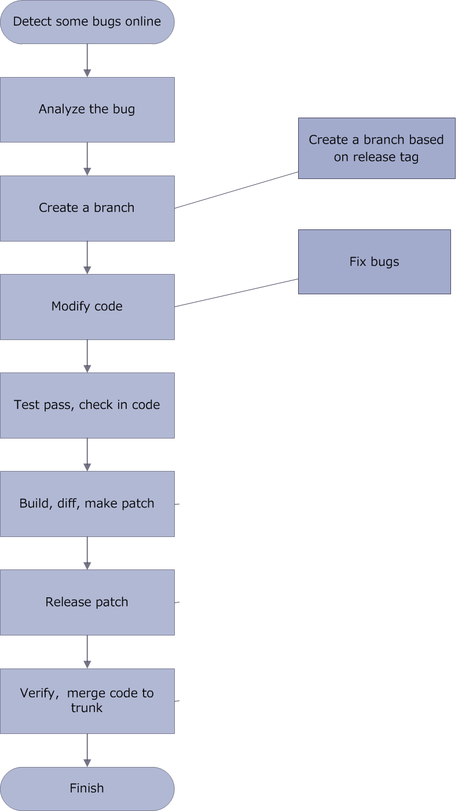
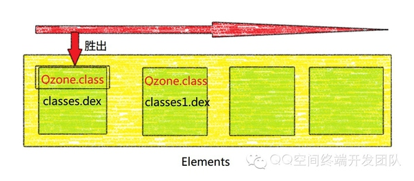
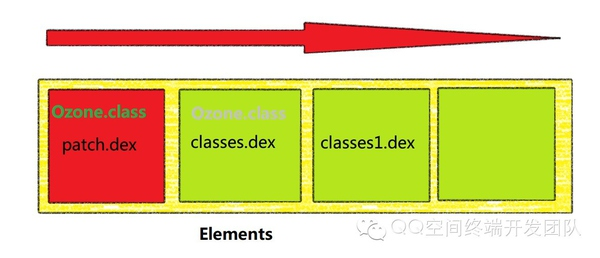

# Android hotfix
## 前言
在软件开发过程我们难免出现各种bug,对于android应用来说如果遇到了严重的bug,修复流程一般如下: 
 
然而我们对用户的可控性很差，导致新版本覆盖率很难控制.而且频繁更新版本会使用户对我们APP的印象变差，[上一篇文](https://github.com/carl1990/Android-DynamicAPK-Plugin)我们介绍介绍了android加载类文件以及插件化实现原理，今天主要讲解一下根据dex分包的方式实现android bug hotfix.

## 技术实现

**思路** 
我们只要找到，发生问题类，并且将其替换为修复后的类就好了 
 

**实现** 

上一篇我们只是说到的了如何加载dex文件，并没有探寻Android是如何加载类文件，借用linux之父的名言`“read the fucking source code”`，接下来还是看源码吧

由于`DexClassLoader` 继承自 `BaseDexClassLoader` 我们先看一下该类的构造方法：

	public BaseDexClassLoader(String dexPath, File optimizedDirectory,
            String libraryPath, ClassLoader parent) {
        super(parent);
        this.pathList = new DexPathList(this, dexPath, libraryPath, 	optimizedDirectory);
	}

接下来进入到`DexPathList` 

	public DexPathList(ClassLoader definingContext, String dexPath,
            String libraryPath, File optimizedDirectory) {
        if (definingContext == null) {
            throw new NullPointerException("definingContext == null");
        }
        if (dexPath == null) {
            throw new NullPointerException("dexPath == null");
        }
        if (optimizedDirectory != null) {
            if (!optimizedDirectory.exists())  {
                throw new IllegalArgumentException(
                        "optimizedDirectory doesn't exist: "
                        + optimizedDirectory);
            }
            if (!(optimizedDirectory.canRead()
                            && optimizedDirectory.canWrite())) {
                throw new IllegalArgumentException(
                        "optimizedDirectory not readable/writable: "
                        + optimizedDirectory);
            }
        }
        this.definingContext = definingContext;
        this.dexElements =
            makeDexElements(splitDexPath(dexPath), optimizedDirectory);
        this.nativeLibraryDirectories = splitLibraryPath(libraryPath);
    }
    
   这里提一下，android Dalvik并不是直接执行dex的他会把dex文件优化成`ODEX`文件，他比dex拥有更高的执行效。[更多关于ODEX](http://stackoverflow.com/questions/9593527/what-are-odex-files-in-android) 这里`optimizedDirectory`下面再讲是干什么的，继续看`makeDexElements`方法
   
   	private static Element[] makeDexElements(ArrayList<File> files, File optimizedDirectory,
                                             ArrayList<IOException> suppressedExceptions) {
     // ……
        for (File file : files) {
            File zip = null;
            DexFile dex = null;
            String name = file.getName();
            if (name.endsWith(DEX_SUFFIX)) {   //.dex文件
                // Raw dex file (not inside a zip/jar).
                try {
                    dex = loadDexFile(file, optimizedDirectory);
                } catch (IOException ex) {
                    System.logE("Unable to load dex file: " + file, ex);
                }
            } else if (name.endsWith(APK_SUFFIX) || name.endsWith(JAR_SUFFIX)
                    || name.endsWith(ZIP_SUFFIX)) {
                    //.apk  .jar  .zip文件
                zip = file;
                try {
                    dex = loadDexFile(file, optimizedDirectory);
                } catch (IOException suppressed) {
                    suppressedExceptions.add(suppressed);
                }
            } else if (file.isDirectory()) {
                // We support directories for looking up resources.
                // This is only useful for running libcore tests.
                elements.add(new Element(file, true, null, null));
            } else {
                System.logW("Unknown file type for: " + file);
            }
        }
                    //……
        return elements.toArray(new Element[elements.size()]);
    }

   	
   	
继续向下看

	private static DexFile loadDexFile(File file, File optimizedDirectory)
            throws IOException {
        if (optimizedDirectory == null) {
            return new DexFile(file);
        } else {
            String optimizedPath = optimizedPathFor(file, optimizedDirectory);
            return DexFile.loadDex(file.getPath(), optimizedPath, 0);
        }
    }
    
    
 下面就是`optimizedPathFor`方法了
 
 	private static String optimizedPathFor(File path,
            File optimizedDirectory) {
        String fileName = path.getName();
        if (!fileName.endsWith(DEX_SUFFIX)) {
            int lastDot = fileName.lastIndexOf(".");
            if (lastDot < 0) {
                fileName += DEX_SUFFIX;
            } else {
                StringBuilder sb = new StringBuilder(lastDot + 4);
                sb.append(fileName, 0, lastDot);
                sb.append(DEX_SUFFIX);
                fileName = sb.toString();
            }
        }
        File result = new File(optimizedDirectory, fileName);
        return result.getPath();
    }

optimizedPathFor主要是对文件的后缀进行修正，如果没有后缀名，就在末尾加上.dex，如果文件结尾不是.dex，就将后缀替换为.dex，然后创建我们的.dex文件，然后返回我们创建的.dex文件的路径，继续执行DexFile.loadDex() 函数

好了到这里我们不在继续往下看了，但是我们已经知道了所有的dex最终都存储在了`Element[]`中。

解下来，就是找到在使用、加载该文件的时候去查找该该文件了，就是在`DexPathList`中的`findClass()`方法中

	 /**
     * Finds the named class in one of the dex files pointed at by
     * this instance. This will find the one in the earliest listed
     * path element. If the class is found but has not yet been
     * defined, then this method will define it in the defining
     * context that this instance was constructed with.
     *
     * @return the named class or {@code null} if the class is not
     * found in any of the dex files
     */
    public Class findClass(String name) {
        for (Element element : dexElements) {
            DexFile dex = element.dexFile;
            if (dex != null) {
                Class clazz = dex.loadClassBinaryName(name, definingContext);
                if (clazz != null) {
                    return clazz;
                }
            }
        }
        return null;
    }
    
它回去遍历我们之前存储进去的dex,在他的注释中注释说的很清楚：会首先加载第一个找到的类： 

那么我的修复方案就是把patch.dex，插入到elments数组的最前面就好

**这个时候你一定以为完事了，哈哈 `too young too native`**

这个时候会报一个

	java.lang.IllegalAccessError: Class ref in pre-verified class resolved to unexpected implementation
	错误
	
google 一下,发现这是由于[DexPrepare.cpp](https://android.googlesource.com/platform/dalvik/+/3740ab6c5b5544e26acb257bc092415b48bdef63/vm/analysis/DexPrepare.cpp)在将Dex转化为ODex过程中[DexVerify.cpp](https://android.googlesource.com/platform/dalvik.git/+/android-4.3_r3/vm/analysis/DexVerify.cpp)中进行校验，验证如果直接引用到的类和clazz是否在同一个Dex，如果是则会打上CLASS_ISPREVERIFIED标志

	虚拟机在启动的时候，会有许多的启动参数，其中一项就是verify选项，当verify选项被打开的时候，就会执行dvmVerifyClass进行类的校验，如果dvmVerifyClass校验类成功，那么这个类会被打上CLASS_ISPREVERIFIED的标志。
	
	怎么样算是校验类成功？如果static方法、private方法、构造函数等，其中的直接引用（第一层关系）到的类都在同一个Dex文件中，那么该类就会被打上CLASS_ISPREVERIFIED标志
	
	我们要做的就是，阻止该类打上CLASS_ISPREVERIFIED的标志。否则加载其他Dex的时候会报错。
	注意下，是阻止引用者的类，也就是说，假设你的app里面有个类叫做LoadBugClass，再其内部引用了BugClass。发布过程中发现BugClass有编写错误，那么想要发布一个新的BugClass类，那么你就要阻止LoadBugClass这个类打上CLASS_ISPREVERIFIED的标志。
	
	你在生成apk之前，就需要阻止相关类打上CLASS_ISPREVERIFIED的标志了。对于如何阻止，可让LoadBugClass在构造方法中，去引用别的dex文件，比如：hack.dex中的某个类即可。
	
	
基于以上技术开源出来的

1. [dodola/HotFix](https://github.com/dodola/HotFix )   (百度实现)
2. [jasonross/Nuwa](https://github.com/jasonross/Nuwa)  (点评实现)
3. [DroidFix](https://github.com/bunnyblue/DroidFix)

## 其他方式
 
### Dexposed 
[Dexposed](https://github.com/alibaba/dexposed) 是阿里基于 `rovo89/Xposed`(对于这个框架不是很了解)的AOP框架 方法级别粒度，而且不仅可以Hot Fix，还可进行AOP编程、插桩、Hook等功能。

Xposed是需要ROOT权限，因为其要修改其他应用及系统行为，而对于单个应用而言，不需要ROOT。Xposed基本原理是：通过修改Dalvik运行时的Zygote进程，使用Xposed Bridge来hook方法并注入自身代码，实现非侵入式的Runtime修改。包括小米（onVmCreated方法），也利用此特性，做了自定义主题、沉浸式状态栏等功能。

应用启动时，会fork zygote进程，装载class和invoke各种初始化方法，Xposed就是在这个过程替换了app_process，hook各个入口方法，加载XposedBridge.jar提供动态hook基础，具体查看XposedBridge。

具体的Native实现则是在libxposed_common.cpp里面，根据系统版本进行分发到libxposed_dalvik或libxposed_art，记录下原来方法信息，将方法指针指向hookedMethodCallback，从而达到劫持目的。
此方式只能对JAVA方法做拦截，不支持C方法。如果线上RELEASE版本进行混淆，patch也是一个痛苦事情，反射和内部类、包名和内部类冲突等处理很繁琐。

### AndFix
[AndFix](https://github.com/alibaba/AndFix) 也是阿里实现的
简单来说，主要通过补丁工具，利用注解等，描述其与要打补丁的类和方法的对应关系，之后在应用中，加载并替换方法的信息和指针，从而达到热修复目的。里面的实现可能还涉及到其他的部分，比如Security检查、PATCH覆盖等,更加详细的内容请和原理请查看[Android热补丁之AndFix原理解析](http://w4lle.github.io/2016/03/03/Android%E7%83%AD%E8%A1%A5%E4%B8%81%E4%B9%8BAndFix%E5%8E%9F%E7%90%86%E8%A7%A3%E6%9E%90/)

### 对比

1. Dexposed不支持Art模式（5.0+），且写补丁有点困难，需要反射写混淆后的代码，粒度太细，要替换的方法多的话，工作量会比较大。
2.  AndFix支持2.3-6.0，但是不清楚是否有一些机型的坑在里面，毕竟jni层不像java曾一样标准，从实现来说，方法类似Dexposed，都是通过jni来替换方法，但是实现上更简洁直接，应用patch不需要重启。但由于从实现上直接跳过了类初始化，设置为初始化完毕，所以像是静态函数、静态成员、构造函数都会出现问题，复杂点的类Class.forname很可能直接就会挂掉
3.  分包方案方案支持2.3-6.0，会对启动速度略微有影响，只能在下一次应用启动时生效，在空间中已经有了较长时间的线上应用，如果可以接受在下次启动才应用补丁，是很好的选择。

总体上来说：**分包方案方案**比较可靠而且在QZone中应用了很久了，且实现简单，唯一的问题就是需要下次启动patch 才会应用

#### 参考
[各大热补丁方案分析和比较](http://blog.zhaiyifan.cn/2015/11/20/HotPatchCompare/) 
[浅析dex文件加载机制](http://www.cnblogs.com/lanrenxinxin/p/4712224.html) 
[QQ空间热补丁动态修复技术](https://zhuanlan.zhihu.com/p/20308548) 
[HotFix](https://github.com/dodola/HotFix ) 
[Nuwa](https://github.com/jasonross/Nuwa)  
[DroidFix](https://github.com/bunnyblue/DroidFix) 