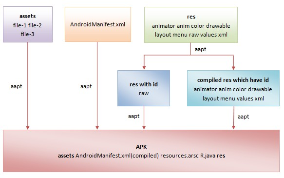
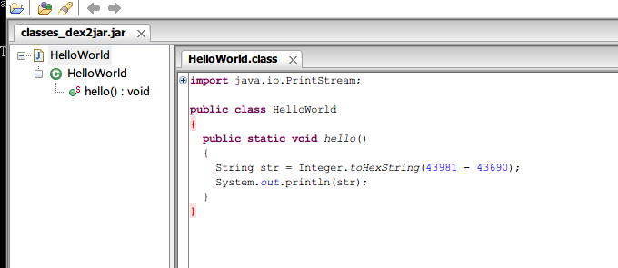

# Android 插件化开发
## 背景
上个周，在经历了四个月的漫长开发后，我们的新一版的应用终于上线，然而，悲剧的是一上线就收到了很严重的崩溃报告，这既有开发不细心，测试不全面的问题，还有就是线上令人捉摸不定的数据，以及android令人发指的碎片化问题。扯远了，有问题就修呗，修完测试，打包，再发布。费时费力啊，苏格拉底曾经说过：“现在移动端的主要矛盾是产品日益增长的功能需求与平台落后的发布流程之间的矛盾”,😄。 
这个时候我们要是能像web一样的热更新就好了（其实是眼热IOS项目都可以随时修bug了，再也不用被QA嫌弃了）,事实上呢大多数时候当我们遇到一个问题的时候，也许答案已经存在了(如果没有恭喜你！你可能就是开拓者)所以这个答案就是android插件化。其实，2015可以说是android 插件化爆发的一年，因为一些大型项目随着业务增长，代码越来越多(65536方法天花板问题，我们的项目由于是在同一个工程实现两个客户端，此前已经遇到了这个问题，当时的解决办法是官方提供的mutildex方案)整个沟通，开发，测试，打包，部署，在原来的方式上难以为继，于是，国内各大公司都纷纷实现出自己的插件化方案，并且开源出来，造福广大程序猿
## 插件化的好处
1. 模块化的方式更利于大项目的协作
2. 热更新，热部署能力（产品再也不用担心因为修复bug频繁发版本，QA再也不用一遍又一遍的回归了）
3. 编译速度的提升。工程被拆分为十来个子工程，插件单独编译。
4. 启动速度提升。Google提供的MultiDex方案，会在主线程中执行所有dex的解压、dexopt、加载操作，这是一个非常漫长的过程，用户会明显的看到长久的黑屏，更容易造成主线程的ANR，导致首次启动初始化失败。
5. 按需加载，内存占用更低 （需要哪个模块，加载哪个模块）

## 技术实现
既然插件化有这么多好处，那我们先来看看要实现插件化技术层面的问题 
众所周知Android的运行最为重要的两部分就是

	1.资源的加载
	2.代码的加载
	
**我们先来看看Android是如何加载资源的：** 
首先关注一下项目中的资源文件是怎么编译打包的： 

那些类型为res/animator、res/anim、res/color、res/drawable（非Bitmap文件，即非.png、.9.png、.jpg、.gif文件）、res/layout、res/menu、res/values和res/xml的资源文件均会从文本格式的XML文件编译成二进制格式的XML文件，如图1所示： 

为了使得一个应用程序能够在运行时同时支持不同的大小和密度的屏幕，以及支持国际化，即支持不同的国家地区和语言，Android应用程序资源的组织方式有18个维度，每一个维度都代表一个配置信息，从而可以使得应用程序能够根据设备的当前配置信息来找到最匹配的资源来展现在UI上，从而提高用户体验。

由于Android应用程序资源的组织方式可以达到18个维度，因此就要求Android资源管理框架能够快速定位最匹配设备当前配置信息的资源来展现在UI上，否则的话，就会影响用户体验。为了支持Android资源管理框架快速定位最匹配资源，Android资源打包工具aapt在编译和打包资源的过程中，会执行以下两个额外的操作：

 	1. 赋予每一个非assets资源一个ID值，这些ID值以常量的形式定义在一个R.java文件中。在R类中生成的每一个int型四字节资源ID，实际上都由三个字段组成。第一字节代表了Package，第二字节为分类，三四字节为类内ID

    2. 生成一个resources.arsc文件，用来描述那些具有ID值的资源的配置信息，它的内容就相当于是一个资源索引表。

有了资源ID以及资源索引表之后，Android资源管理框架就可以迅速将根据设备当前配置信息来定位最匹配的资源了。接下来我们在分析Android应用程序资源的编译和打包过程中，就主要关注XML资源的编译过程、资源ID文件R.java的生成过程以及资源索引表文件resources.arsc的生成过程。

Android资源打包工具在编译应用程序资源之前，会创建一个资源表。这个资源表使用一个ResourceTable对象来描述，当应用程序资源编译完成之后，它就会包含所有资源的信息。有了这个资源表之后， Android资源打包工具就可以根据它的内容来生成资源索引表文件resources.arsc了。

 
好了，资源的生成狗偶成已经了解我们在看一下资源的加载
在android中都会调用`getReSource()`方法来加载资源

先看一下Resource类

	public Resources(AssetManager assets, DisplayMetrics metrics, Configuration config,
            CompatibilityInfo compatInfo, IBinder token) {
        mAssets = assets;
        mMetrics.setToDefaults();
        if (compatInfo != null) {
            mCompatibilityInfo = compatInfo;
        }
        mToken = new WeakReference<IBinder>(token);
        updateConfiguration(config, metrics);
        assets.ensureStringBlocks();
    }
    
    
   看到其实是代理给了AssetManager 的`ensureStringBlocks()`接着往下看
   	
   	  /*package*/ final void ensureStringBlocks() {
        if (mStringBlocks == null) {
            synchronized (this) {
                if (mStringBlocks == null) {
                    makeStringBlocks(sSystem.mStringBlocks);
                }
            }
        }
    }
    
    
  函数先判断mStringBlocks变量是否为空，如果不为空的话，表示需要被初始化，于是调用makeStringBlocks函数初始化mStringBlocks:
  
  	/*package*/ final void makeStringBlocks(StringBlock[] seed) {
    final int seedNum = (seed != null) ? seed.length : 0;
    final int num = getStringBlockCount();
    mStringBlocks = new StringBlock[num];
    if (localLOGV) Log.v(TAG, "Making string blocks for " + this
            + ": " + num);
    for (int i=0; i<num; i++) {
        if (i < seedNum) {
            mStringBlocks[i] = seed[i];
        } else {
            mStringBlocks[i] = new StringBlock(getNativeStringBlock(i), true);
        }
    }
	}

这里的mStringBlocks对象是一个StringBlock数组，这个类被标记为@hide，表示应用层根本不需要关心它的存在。那么它是做什么用的呢，它就是AssetManager能够访问资源的奥秘所在，AssetManager所有访问资源的函数，例如getResourceTextArray()，都最终通过StringBlock再代理到native进行访问的。看到这里，依然没有任何看到能够指示为什么开发者可以访问自己应用的资源，那么我们再看得前面一点，看看传入Resources的构造函数之前，asset参数是不是被“做过手脚”。函数调用辗转到ResourceManager的getTopLevelResources函数:

	/**
     * Creates the top level Resources for applications with the given compatibility info.
     *
     * @param resDir the resource directory.
     * @param overlayDirs the resource overlay directories.
     * @param libDirs the shared library resource dirs this app references.
     * @param compatInfo the compability info. Must not be null.
     * @param token the application token for determining stack bounds.
     */
    public Resources getTopLevelResources(String resDir, String[] splitResDirs,
            String[] overlayDirs, String[] libDirs, int displayId,
            Configuration overrideConfiguration, CompatibilityInfo compatInfo, IBinder token) {
            ………………………………
            
            if (resDir != null) {
            if (assets.addAssetPath(resDir) == 0) {
                return null;
            }
        }
        
        ……………………………………………………
    }
    
  函数代码有点多，截取最重要的部分，那就是系统通过调用AssetManager的addAssetPath函数，将需要加载的资源路径加了进去。
  
  	 public final int addAssetPath(String path) {
        synchronized (this) {
            int res = addAssetPathNative(path);
            makeStringBlocks(mStringBlocks);
            return res;
        }
    }

    private native final int addAssetPathNative(String path);
  
  addAssetPath函数返回一个int类型，它指示了每个被添加的资源路径在native层一个数组中的位置，这个数组保存了系统资源路径(framework-res.apk)，和应用自己添加的所有的资源路径。再回过头看makeStringBlocks函数，就豁然开朗了：
  
  	1. makeStringBlocks函数的参数也是一个StringBlock数组，它表示系统资源，首先它调用getStringBlockCount函数得到当前应用所有要加载的资源路径数量。
 	2. 然后进入循环，如果属于系统资源，就直接用传入参数seed中的对象来赋值。
	3. 如果是应用自己的资源，就实例化一个新的StringBlock对象来赋值。并在StringBlock的构造函数中调用getNativeStringBlock函数来获取一个native层的对象指针，这个指针被java层StringBlock对象用来调用native函数，最终达到访问资源的目的。
	
**我们只需反射调用这个方法，然后把插件apk的位置告诉AssetManager类，它就会根据插件apk内的resources.arsc和已编译资源完成资源加载的任务了。**

**第二步就需要看看怎么加载类文件了** 
在Android项目中，所有的java代码最终都会经过SDK的DX工具把.jar文件优化成.dex文件（在“android-sdk\build-tools\具体版本\”路径下）。那么运行代码也就是运行dex文件了。 
我们从google官方的的mutilDex的解决办法中可以看到：
	
	public class MultiDexApplication extends Application {
  		@Override
  		protected void attachBaseContext(Context base) {
    		super.attachBaseContext(base);
    		MultiDex.install(this);
  		}
	}
	
在mutilDex中

	private static void install(ClassLoader loader, List<File> additionalClassPathEntries,
     File optimizedDirectory)
             throws IllegalArgumentException, IllegalAccessException,
             NoSuchFieldException, InvocationTargetException, NoSuchMethodException {
    /* The patched class loader is expected to be a descendant of
    * dalvik.system.BaseDexClassLoader. We modify its
    * dalvik.system.DexPathList pathList field to append additional DEX
    * file entries.
    */
    Field pathListField = findField(loader, "pathList");
    Object dexPathList = pathListField.get(loader);
    expandFieldArray(dexPathList, "dexElements", makeDexElements(dexPathList,
         new ArrayList<File>(additionalClassPathEntries), optimizedDirectory));
	}

可以看出他是通过classLoader来加载可执行文件的。

Android的虚拟机不能用ClassCload直接加载.dex，而是要用DexClassLoader或者PathClassLoader,他们都是ClassLoader的子类，这两者的区别是

1. DexClassLoader：可以加载jar/apk/dex，可以从SD卡中加载未安装的apk；
2. PathClassLoader：要传入系统中apk的存放Path，所以只能加载已经安装的apk文件；

显然我们要加在插件中的类是未安装的，那就去看看DexClassLoader：
	
	public DexClassLoader(String dexPath, String optimizedDirectory, String libraryPath, ClassLoader parent) {
        super((String)null, (File)null, (String)null, (ClassLoader)null);
        throw new RuntimeException("Stub!");
    }
    
    
我们之前提到的，DexClassLoader并不能直接加载外部存储的.dex文件，而是要先拷贝到内部存储里。这里的dexPath就是.dex的外部存储路径，而optimizedDirectory则是内部路径，libraryPath用null即可，parent则是要传入当前应用的ClassLoader，这与ClassLoader的“双亲代理模式”有关.[ClassLoader双亲模式参考](https://segmentfault.com/a/1190000004062880)

实际使用如下：

	File optimizedDexOutputPath = new File(Environment.getExternalStorageDirectory().getAbsolutePath() + File.separator + "test_dexloader.jar");// 外部路径
	File dexOutputDir = this.getDir("dex", 0);// 无法直接从外部路径加载.dex文件，需要指定APP内部路径作为缓存目录（.dex文件会被解压到此目录）
	DexClassLoader dexClassLoader = new 	DexClassLoader(optimizedDexOutputPath.getAbsolutePath(),dexOutputDir.getAbsolutePath(), null, getClassLoader());
	
**至此，我们就将Dex文件加载进来了，接下来就是如何调用dex中的代码啦：**

使用DexClassLoader加载进来的类，我们本地并没有这些类的源码，所以无法直接调用，不过可以通过反射的方法调用，简单粗暴。

	DexClassLoader dexClassLoader = new DexClassLoader(optimizedDexOutputPath.getAbsolutePath(), dexOutputDir.getAbsolutePath(), null, getClassLoader());
            Class libProviderClazz = null;
            try {
                libProviderClazz = dexClassLoader.loadClass("me.kaede.dexclassloader.MyLoader");
                // 遍历类里所有方法
                Method[] methods = libProviderClazz.getDeclaredMethods();
                for (int i = 0; i < methods.length; i++) {
                    Log.e(TAG, methods[i].toString());
                }
                Method start = libProviderClazz.getDeclaredMethod("func");// 获取方法
                start.setAccessible(true);// 把方法设为public，让外部可以调用
                String string = (String) start.invoke(libProviderClazz.newInstance());// 调用方法并获取返回值
                Toast.makeText(this, string, Toast.LENGTH_LONG).show();
            } catch (Exception exception) {
                // Handle exception gracefully here.
                exception.printStackTrace();
            }

接下来我们要考虑一下下`android 5.0`的兼容模式了，因为5.0之后android类加载的方式改为了`ART`模式.

其实，ART模式相比原来的Dalvik，会在安装APK的时候，使用Android系统自带的dex2oat工具把APK里面的.dex文件转化成OAT文件，OAT文件是一种Android私有ELF文件格式，它不仅包含有从DEX文件翻译而来的本地机器指令，还包含有原来的DEX文件内容。这使得我们无需重新编译原有的APK就可以让它正常地在ART里面运行，也就是我们不需要改变原来的APK编程接口。ART模式的系统里，同样存在DexClassLoader类，包名路径也没变，只不过它的具体实现与原来的有所不同，但是接口是一致的。

	public class DexClassLoader extends BaseDexClassLoader {
    	public DexClassLoader(String dexPath, String optimizedDirectory, String libraryPath, ClassLoader parent) {
        	super((String)null, (File)null, (String)null, (ClassLoader)null);
        	throw new RuntimeException("Stub!");
    	}
	}

也就是说，ART模式在加载.dex文件的方法上，对Dalvik做了向下兼容，所以使用DexClassLoader加载进来的.dex文件同样也会被转化成OAT文件再被执行，“以DexClassLoader为核心的动态加载方案”在ART模式上可以稳定运行。

好了，至此各位看客一定以为大功告成，然而一山还比一山高，一坑还比一坑难啊，**如何管理activty的生命周期**就是接下来的难题。

通过ClassLoader加载并实例化的Activity实例只是一个普通的Java对象，能调用对象的方法，但是它没有生命周期，而且Activity等系统组件是需要Android的上下文环境的（Context等资源），没有这些东西Activity根本无法工作 

我们在正常开发一个应用的时候必须把使用到的activity，注册到项目的AndroidManifest.xml中，这样在应用被安装和启动到的时候能够找到这个类,并且维护起生命周期以及上下文变量，具体详细步骤请移步大神老罗的[Android应用程序启动过程源代码分析](http://blog.csdn.net/luoshengyang/article/details/6689748)

这里面重点关注：

	   Activity activity = null;
  	   try {
			java.lang.ClassLoader cl = r.packageInfo.getClassLoader();
			activity = mInstrumentation.newActivity(
			cl, component.getClassName(), r.intent);
			r.intent.setExtrasClassLoader(cl);
			if (r.state != null) {
				r.state.setClassLoader(cl);
		}
   	} catch (Exception e) {
		......
   	}		  

和

	   mInstrumentation.callActivityOnCreate(activity, r.state);
	   
可见其生命周期周期都是由`mInstrumentation`来管理的， 这里的mInstrumentation是Activity类的成员变量，它的类型是Intrumentation，定义在frameworks/base/core/java/android/app/Instrumentation.java文件中，它用来监控应用程序和系统的交互。
我们是不能改动和获取的。

可能有人说，那我们直接把需要的activity，直接事先注册在主项目中啊，那我们岂不是本末倒置了。
所以就有人研究出了更好的办法：

**1 代理Activity 模式**

生命周期不就是系统对Activity一些特定方法的调用嘛，那我们可以在主项目里创建一个ProxyActivity，再由它去代理调用插件Activity的生命周期方法（这也是代理模式叫法的由来）。用ProxyActivity（一个标准的Activity实例）的生命周期同步控制插件Activity（普通类的实例）的生命周期，同步的方式可以有下面两种：

1. 在ProxyActivity生命周期里用反射调用插件Activity相应生命周期的方法，简单粗暴。
2. 把插件Activity的生命周期抽象成接口，在ProxyActivity的生命周期里调用。另外，多了这一层接口，也方便主项目控制插件Activity。

**2 动态创建Activity模式 （黑科技有木有）**

使用代理Activity能够解决这两个问题，但是有一些限制

1. 实际运行的Activity实例其实都是ProxyActivity，并不是真正想要启动的Activity；
2. ProxyActivity只能指定一种LaunchMode，所以插件里的Activity无法自定义LaunchMode；
3. 不支持静态注册的BroadcastReceiver；
往往不是所有的apk都可作为插件被加载，插件项目需要依赖特定的框架，还有需要遵循一定的"开发规范"；
4. 特别是最后一个，无法直接把一个普通的APK作为插件使用。怎么避开这些限制呢？插件的Activity不是标准的Activity对象才会有这些限制，使其成为标准的Activity是解决问题的关键，而要使其成为标准的Activity，则需要在主项目里注册这些Activity。

运行时动态创建并编译一个Activity类，这种想法不是天方夜谭，动态创建类的工具有dexmaker和asmdex，二者均能实现动态字节码操作，最大的区别是前者是创建dex文件，而后者是创建class文件。

	public class MainActivity extends AppCompatActivity {

    @Override
    protected void onCreate(Bundle savedInstanceState) {
        super.onCreate(savedInstanceState);
        setContentView(R.layout.activity_main);
    }

    public void onMakeDex(View view){
        try {
            DexMaker dexMaker = new DexMaker();
            // Generate a HelloWorld class.
            TypeId<?> helloWorld = TypeId.get("LHelloWorld;");
            dexMaker.declare(helloWorld, "HelloWorld.generated", Modifier.PUBLIC, TypeId.OBJECT);
            generateHelloMethod(dexMaker, helloWorld);
            // Create the dex file and load it.
            File outputDir = new File(Environment.getExternalStorageDirectory() + File.separator + "dexmaker");
            if (!outputDir.exists())outputDir.mkdir();
            ClassLoader loader = dexMaker.generateAndLoad(this.getClassLoader(), outputDir);
            Class<?> helloWorldClass = loader.loadClass("HelloWorld");
            // Execute our newly-generated code in-process.
            helloWorldClass.getMethod("hello").invoke(null);
        } catch (Exception e) {
            Log.e("MainActivity","[onMakeDex]",e);
        }
    }

    /**
     * Generates Dalvik bytecode equivalent to the following method.
     *    public static void hello() {
     *        int a = 0xabcd;
     *        int b = 0xaaaa;
     *        int c = a - b;
     *        String s = Integer.toHexString(c);
     *        System.out.println(s);
     *        return;
     *    }
     */
    private static void generateHelloMethod(DexMaker dexMaker, TypeId<?> declaringType) {
        // Lookup some types we'll need along the way.
        TypeId<System> systemType = TypeId.get(System.class);
        TypeId<PrintStream> printStreamType = TypeId.get(PrintStream.class);

        // Identify the 'hello()' method on declaringType.
        MethodId hello = declaringType.getMethod(TypeId.VOID, "hello");

        // Declare that method on the dexMaker. Use the returned Code instance
        // as a builder that we can append instructions to.
        Code code = dexMaker.declare(hello, Modifier.STATIC | Modifier.PUBLIC);

        // Declare all the locals we'll need up front. The API requires this.
        Local<Integer> a = code.newLocal(TypeId.INT);
        Local<Integer> b = code.newLocal(TypeId.INT);
        Local<Integer> c = code.newLocal(TypeId.INT);
        Local<String> s = code.newLocal(TypeId.STRING);
        Local<PrintStream> localSystemOut = code.newLocal(printStreamType);

        // int a = 0xabcd;
        code.loadConstant(a, 0xabcd);

        // int b = 0xaaaa;
        code.loadConstant(b, 0xaaaa);

        // int c = a - b;
        code.op(BinaryOp.SUBTRACT, c, a, b);

        // String s = Integer.toHexString(c);
        MethodId<Integer, String> toHexString
                = TypeId.get(Integer.class).getMethod(TypeId.STRING, "toHexString", TypeId.INT);
        code.invokeStatic(toHexString, s, c);

        // System.out.println(s);
        FieldId<System, PrintStream> systemOutField = systemType.getField(printStreamType, "out");
        code.sget(systemOutField, localSystemOut);
        MethodId<PrintStream, Void> printlnMethod = printStreamType.getMethod(
                TypeId.VOID, "println", TypeId.STRING);
        code.invokeVirtual(printlnMethod, null, localSystemOut, s);

        // return;
        code.returnVoid();
   	 }
    
	}
运行后在SD卡的dexmaker目录下找到刚创建的文件“Generated1532509318.jar”，把里面的“classes.dex”解压出来，然后再用“dex2jar”工具转化成jar文件，最后再用“jd-gui”工具反编译jar的源码。

接下来的问题是如何把需要启动的、在Manifest里面没有注册的PlugActivity换成有注册的TargetActivity。

在Android，虚拟机加载类的时候，是通过ClassLoader的loadClass方法，而loadClass方法并不是final类型的，这意味着我们可以创建自己的类去继承ClassLoader，以重载loadClass方法并改写类的加载逻辑，在需要加载PlugActivity的时候，偷偷把其换成TargetActivity。

大致思路如下

	public class CJClassLoader extends ClassLoader{

	@override
    public Class loadClass(String className){
      if(当前上下文插件不为空) {
        if( className 是 TargetActivity){
             找到当前实际要加载的原始PlugActivity，动态创建类（TargetActivity extends PlugActivity ）的dex文件
             return  从dex文件中加载的TargetActivity
        }else{
             return  使用对应的PluginClassLoader加载普通类
        }  
     }else{
         return super.loadClass() //使用原来的类加载方法
     }   
    } 
	}	
	
	
不过还有一个问题，主项目启动插件Activity的时候，我们可以替换Activity，但是如果在插件Activity（比如MainActivity）启动另一个Activity（SubActivity）的时候怎么办？插件时普通的第三方APK，我们无法更改里面跳转Activity的逻辑。其实，从主项目启动插件MainActivity的时候，其实启动的是我们动态创建的TargetActivity（extends MainActivity），而我们知道Activity启动另一个Activity的时候都是使用其“startActivityForResult”方法，所以我们可以在创建TargetActivity时，重写其“startActivityForResult”方法，让它在启动其他Activity的时候，也采用动态创建Activity的方式，这样就能解决问题。

## 总结
迫切的需求迫使我们寻求新的出路，虽然已经有高人帮我们铺路，但是在实现的过程中我们还难免会遇到各种各样的问题，所以这个方案适不适合使用，以及使用它所带来的代价是否我们可以承受的，还需具体考量，目前打算在项目中使用一下，做一些灰度测试.目前的现状是只有在大天朝才有比较深入的研究和应用，特别是一些SDK组件项目和 BAT家族 的项目上，Github上的相关开源项目基本是国人在维护，偶尔有几个外国人请求更新英文文档。

## 扩展（开源项目）
1. [DynamicLoadApk](https://github.com/singwhatiwanna/dynamic-load-apk)原理是 DexClassLoader 加 Activity 代理

2. [AndroidDynamicLoader](https://github.com/mmin18/AndroidDynamicLoader)这是点评一个工程师介绍的方式，和上面不同的是：他不是用代理 Activity 的方式实现而是用 Fragment 以及 schema 的方式实现  
3. [Android PluginManager](https://github.com/houkx/android-pluginmgr
) 就是上面提到的黑科技

4. [360 的 DroidPlugin](https://github.com/Qihoo360/DroidPlugin)

5. [携程实现方式](https://github.com/CtripMobile/DynamicAPK) 是通过修改编译参数方式实现的，也有点儿黑科技的味道，之前有幸和他们的负责人聊过实现方式，感觉需要对是android编译原理有深入了解才行

6. [淘宝的atlas](https://github.com/bunnyblue/ACDD) 不明觉厉

参考 : 

<https://mp.weixin.qq.com/s?__biz=MzAwMTcwNTE0NA==&mid=400217391&idx=1&sn=86181541ce0164156dfab135ed99bb5c&scene=1&srcid=1104k7DyMIQcy3dn4V92ej53&key=b28b03434249256b896f2f086a6011ab994d044aeae8d63c72c9fc3243ad1f93639d9aaf397de74b2b5038af885cf8d1&ascene=0&uin=OTIzMDExMjgx&devicetype=iMac+MacBookPro11%2C4+OSX+OSX+10.10.5+build(14F1605)&version=11020201&pass_ticket=ybD0d1rqopZeSSNMTp%2BfXFdMcdIKht194KS84io5O274qwxMUJPKWrMTnNshMNRK> 
<http://mogu.io/117-117>  
<http://weishu.me/2016/01/28/understand-plugin-framework-overview/> 
<https://segmentfault.com/a/1190000004062866> 
<https://segmentfault.com/a/1190000004077469> 
<http://blog.csdn.net/luoshengyang/article/details/6689748> 
<https://www.zhihu.com/question/19981105>

